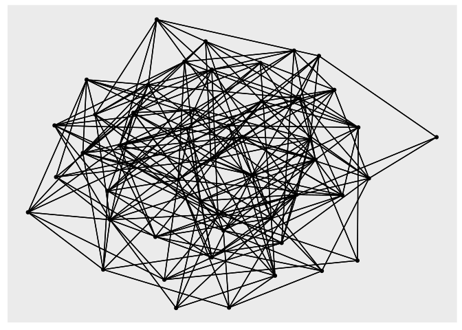

<!-- README.md is generated from README.Rmd. Please edit that file -->

# RcppRustCompare

<!-- badges: start -->

[](https://www.tidyverse.org/lifecycle/#experimental)
<!-- badges: end -->

Quick comparison of Rust/Rcpp integration in R vis-a-vis the generation
of Erdos-Renyi random graphs (adjacency lists).

## Rust installation

Visit <https://www.rust-lang.org/tools/install> for information on
installing Rust. Note that `cargo` is only needed at build-time.

## Package installation

`devtools::install_github("tjtnew/RcppRustCompare")`

## Example

``` r
library(RcppRustCompare)
library(ggraph)
library(tidygraph)

# small graphs
n <- 50 # size of graph
p <- 0.2 # probability of edge between two nodes

ggraph(as_tbl_graph(erdos_rust(n, p))) +
  geom_edge_link() +
  geom_node_point()
#> Using `stress` as default layout
```


``` r

ggraph(as_tbl_graph(erdos_rcpp(n, p))) +
  geom_edge_link() +
  geom_node_point()
#> Using `stress` as default layout
```



``` r


## larger graphs - we check average degree is roughly p * (n - 1)
n <- 10000
avk <- 5
p <- avk / (n - 1)
graph_rust <- erdos_rust(n, p)
graph_rcpp <- erdos_rcpp(n, p)

mean(sapply(graph_rust, length))
#> [1] 5.054
mean(sapply(graph_rcpp, length))
#> [1] 4.98
```

## benchmarks - dense graphs

Comparable performance between the Rcpp implementation and Rust.

``` r
library(microbenchmark)

microbenchmark(
  erdos_rust(10000, 0.1),
  erdos_rcpp(10000, 0.1),
  erdos_rust(10000, 0.2),
  erdos_rcpp(10000, 0.2),
  erdos_rust(10000, 0.4),
  erdos_rcpp(10000, 0.4),
  erdos_rust(10000, 0.8),
  erdos_rcpp(10000, 0.8),
  times = 10
)
#> Unit: milliseconds
#>                    expr    min     lq   mean median     uq    max neval
#>  erdos_rust(10000, 0.1)  468.1  475.8  478.1  476.8  482.2  488.8    10
#>  erdos_rcpp(10000, 0.1)  763.6  765.7  768.2  766.8  770.6  774.0    10
#>  erdos_rust(10000, 0.2)  568.0  574.9  580.6  578.6  582.5  600.8    10
#>  erdos_rcpp(10000, 0.2) 1008.9 1023.1 1025.2 1026.4 1027.5 1037.6    10
#>  erdos_rust(10000, 0.4)  747.4  750.5  792.2  773.7  783.0 1021.3    10
#>  erdos_rcpp(10000, 0.4) 1542.3 1545.4 1562.5 1554.0 1582.2 1591.3    10
#>  erdos_rust(10000, 0.8)  801.3  896.1  899.8  918.3  930.7  949.8    10
#>  erdos_rcpp(10000, 0.8) 2123.6 2149.8 2189.9 2182.4 2208.2 2306.5    10
```

## benchmarks - sparse graph

For sparse graphs we can use the algorithm from Batagelj and Brandes,
[Efficient Generation of Large Random
Networks](https://journals.aps.org/pre/abstract/10.1103/PhysRevE.71.036113).

``` r
n <- 1000000
avk <- 5
p <- avk / (n - 1)
microbenchmark(fast_erdos_rust(n, p), times = 10)
#> Unit: milliseconds
#>                   expr   min  lq  mean median    uq   max neval
#>  fast_erdos_rust(n, p) 663.3 674 691.1  683.9 701.2 743.5    10
```

This even compares well with the implementation in igraph (although
igraph has a far more complete graph representation than this toy code):

``` r
library(igraph)
microbenchmark(sample_gnp(n, p), times = 10)
#> Unit: milliseconds
#>              expr min    lq  mean median    uq   max neval
#>  sample_gnp(n, p) 784 811.6 833.3  820.4 827.6 963.5    10
```
